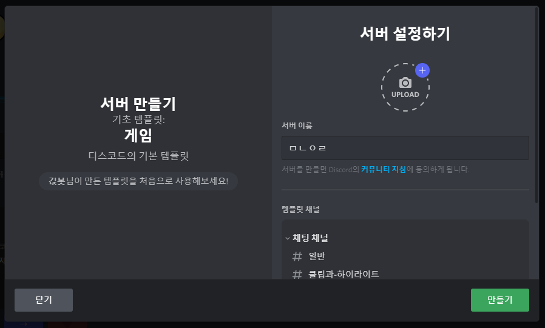

    

    
    

    <a href="https://c11.kr/discordbot_ginzb" target="_blank" title="초대하기">
        <b>긵봇</b>
    </a>

# 긵봇

**긵봇**은 서버 템플릿을 공유하고 적용할 수 있는 봇입니다!

## 명령어

`/서버_템플릿 생성` `/서버_템플릿 삭제` `/서버_템플릿 불러오기` `/서버_템플릿 적용`

`/공유_템플릿 공유` `/공유_템플릿 삭제` `/공유_템플릿 검색`

`/건의`

## 사용법

### /서버_템플릿

**생성**

> 서버 템플릿을 생성합니다.

> **옵션**
> - `이름`: 템플릿 이름
> - `설명(선택)`: 템플릿 설명

**삭제**

> 서버 템플릿을 삭제합니다.

**불러오기**

> 서버 템플릿을 불러옵니다.

**적용**

> 서버 템플릿을 적용합니다.

> **옵션**
> - `코드`: 템플릿 코드

### /공유_템플릿

**공유**

> 서버 템플릿을 공유합니다.

> **옵션**
> - `태그`: 공유 템플릿의 태그 _(깔끔, 단순, 복잡, 게임, 그림, 친목, 봇)_

**삭제**

> 공유 템플릿을 삭제합니다.

**목록**

> 공유 템플릿의 목록을 불러옵니다.

> **선택**
> - `태그`: 공유 템플릿의 태그 _(기본, 깔끔, 단순, 복잡, 게임, 그림, 친목, 봇)_

> **기능**
> - `하트`: 검색한 템플릿에 하트를 누를 수 있습니다.

# (참고) 서버 템플릿

서버 템플릿은 서버의 채널, 역할 등을 그대로 복사해 다른 서버에 적용할 수 있는 기능입니다.

