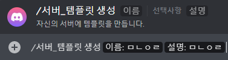

<p align="center">
    
</p>

<p align="center">
    
    
</p>

<p align="center">
    <a href="https://c11.kr/discordbot_ginzb" target="_blank" title="초대하기">
        <b>긵봇</b>
    </a>
</p>


# 긵봇

**긵봇**은 서버 템플릿을 공유하고 적용할 수 있는 봇입니다!

## 기능

`/서버_템플릿 생성` `/서버_템플릿 삭제` `/서버_템플릿 불러오기` `/서버_템플릿 적용`

`/공유_템플릿 공유` `/공유_템플릿 삭제` `/공유_템플릿 검색`

`/건의`

## 사용법

### /서버_템플릿

> 생성



```
서버 템플릿을 생성합니다.
```

> 삭제


```
서버 템플릿을 삭제합니다.
```

> 생성


```
서버 템플릿을 생성합니다.
```

> 생성


```
서버 템플릿을 생성합니다.
```

# (참고) 서버 템플릿


서버 템플릿은 서버의 채널, 역할 등을 그대로 복사해 다른 서버에 적용할 수 있는 기능입니다.


